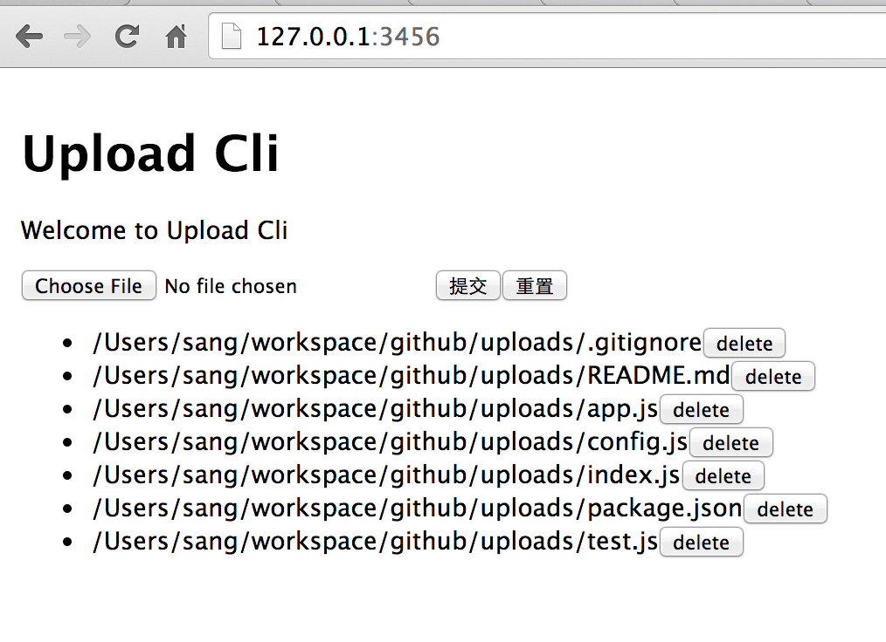

# uploads

a cli tools for uploads ui

[](http://badge.fury.io/js/upload-cli)

## Install

	sudo npm install -g upload-cli
	
## Usage 

in current dir,execute `uc` command

	  uc
	
result

```
	 somedir git:(master) uc

	> upload-cli@0.1.0 test /Users/sang/workspace/github/uploads
	> node index.js

	[up-cli INFO] It's served! now you can open in browser http://127.0.0.1:3456/
```

if you want use it in terminal

```
➜  upload-cli git:(master) uci package.json                            
package.json
Upload successful! http://127.0.0.1:3456/
```

## for post


- url = http://127.0.0.1:3456/post/formdata.json
- filename = xxxx

返回


```
{
    "data": {
        "path": "/Users/sang/workspace/github/uploads"
    },
    "status": {
        "code": 0,
        "msg": "success."
    }
}
```

**使用curl命令**

```
➜  uploads git:(master) ✗ curl -F filename=@/Users/sang/workspace/github/api-test/play/file/da_qin_huang_ling_.mobi http://127.0.0.1:3456/post/formdata.json
{"data":{"path":"/Users/sang/workspace/github/uploads"},"status":{"code":0,"msg":"success."}}%   
```

## Preview 




## for dev 

debug with node-inspector

	npm run debug
	
publish to npmjs.org

	npm run deploy 


## TODO

[uci] add option -h or --host  #3

- uci file
- uci -h 127.0.0.1 file
- uci -h 127.0.0.1 -f file